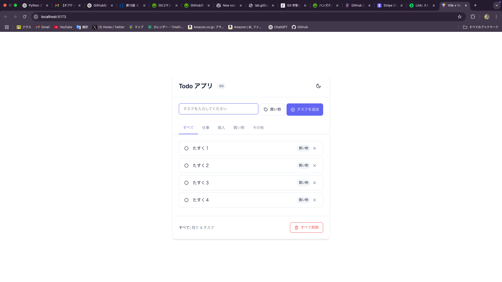
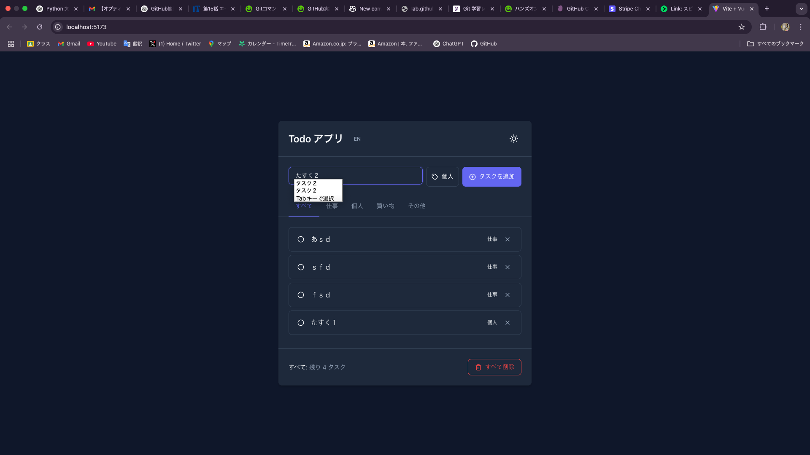
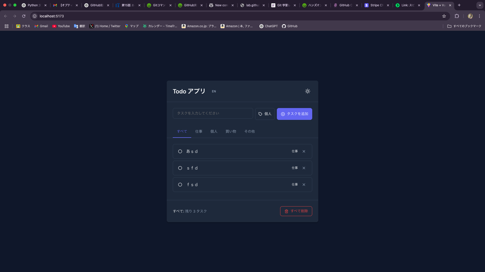
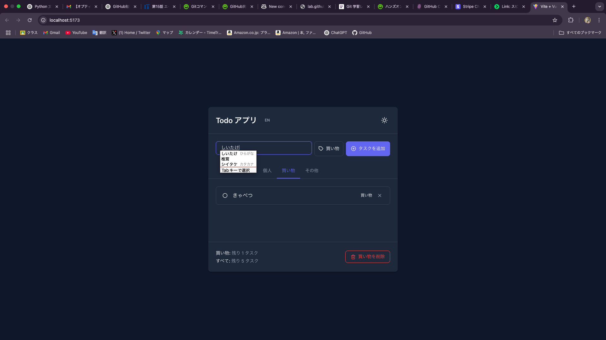
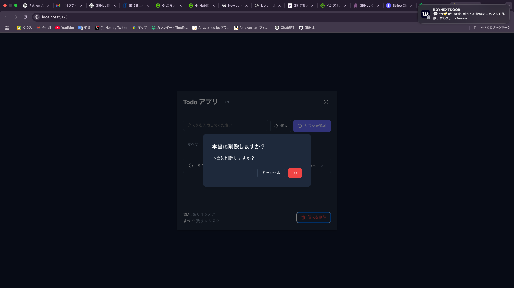
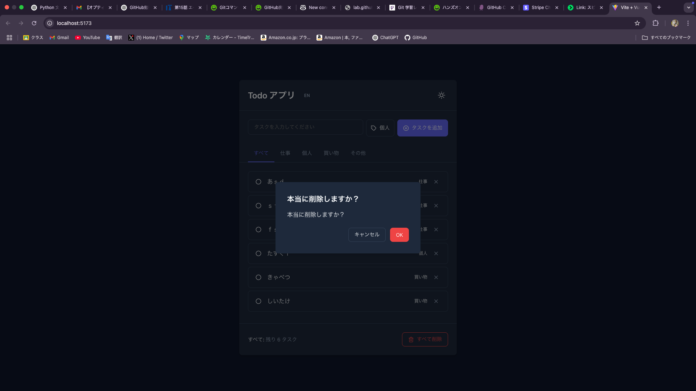
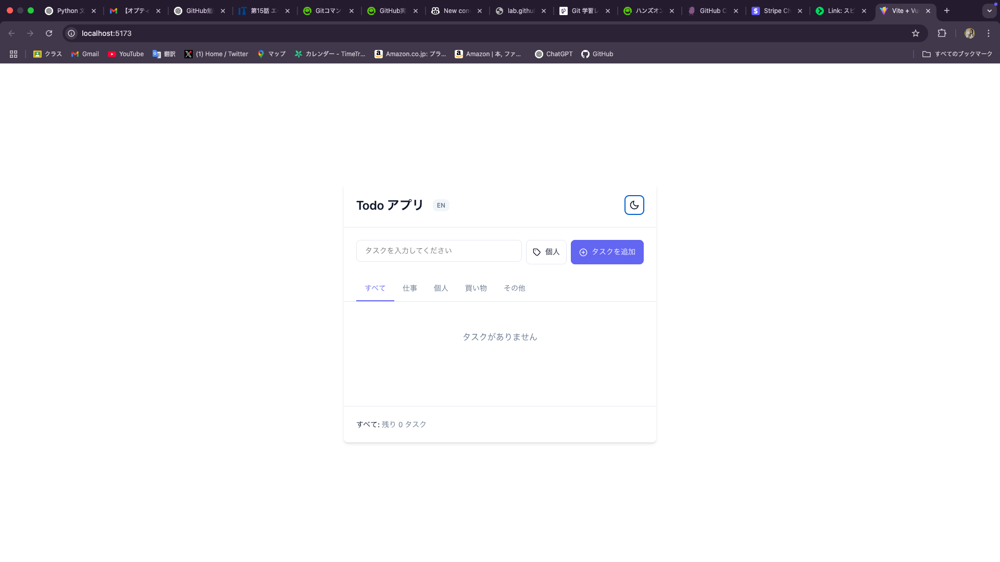
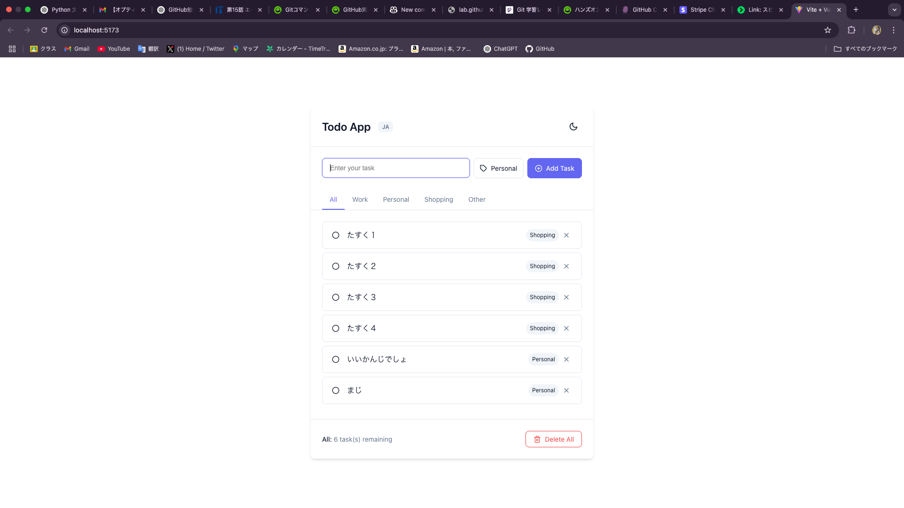

# Todoアプリ 操作手順

以下の操作手順では、Vue3/TypeScriptで実装されたTodoアプリ（Vite開発サーバー：`localhost:5173`）の基本的な使い方を解説します。画面例はダークモード時のキャプチャを中心に、最後にライトモードも示しています。

---

## 1. アプリ起動

1. ターミナルでプロジェクトディレクトリに移動し、`npm install`を実行  
2. `npm run dev`で開発サーバーを起動  
3. ブラウザで `http://localhost:5173` を開く  

> 図1：初期画面（タスクなし）  
> 

---

## 2. タスクの追加

1. 入力ボックスにタスク名を入力します。  
2. 右側のタグ選択ボタン（例：`個人`）をクリックし、タグを選択。  
3. 「タスクを追加」ボタンをクリック。  

> 図2：タスク入力／タグ選択  
> 

> 図3：タスクが追加された状態（例：すべて／仕事カテゴリ）  
> 

---

## 3. 自動候補 (Autocomplete)

- 過去に入力したタスク名を再利用したい場合、入力中にリストから選択できます。  
- `Tab`キーで候補を確定できます。  

> 図4：Autocompleteによる候補表示  
> 

---

## 4. カテゴリ別フィルタ

- 上部タブで、`すべて / 仕事 / 個人 / 買い物 / その他` を切り替え、該当タグのタスクのみ表示できます。  

> 図5：買い物カテゴリを表示  
> 

---

## 5. タスクの削除

1. 各タスク右端の「✕」をクリック。  
2. 確認ダイアログが表示されるので、「OK」で確定。  

> 図6：削除確認ダイアログ  
> 

---

## 6. 全削除／カテゴリ削除

- 下部の赤いボタンで、表示中タスクをすべて削除できます。  
  - `すべて削除`：全カテゴリのタスクを一括削除  
  - `買い物を削除`：現在選択中の「買い物」カテゴリのタスクのみ削除  

> 図7：全削除ボタン  
> 

---

## 7. テーマ切り替え（ダーク／ライトモード）

- 右上の月／太陽アイコンをクリックすると、ダーク／ライトモードを切り替え。  

> 図8：ライトモード例  
> 

以上が基本的な操作手順です。用途に合わせてタスクを追加・管理してください。

